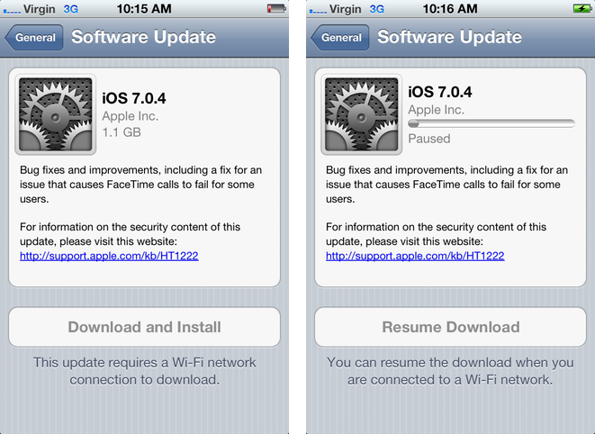
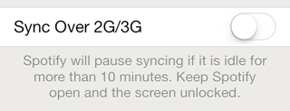

#Use case and requirements for network information
This document outlines the use cases and requirements for giving web applications access to network information. The use cases and requirements were gathered by looking at what both Websites and native platforms currently do with such information.

The main questions this document seeks to explore are:

 * What can an application do when it knows the kind of connection the user's device is using?
 * How does an application respond to when the device switches from one kind of network connection to another?
 * What are the motivations for using this information within an application?
 * Does the application use raw bandwidth info to adapt content?

##Web

### BBC News Website
When the user tries to watch a video on cellular, the Website warns the user that it might cost them money if they proceed.

When the site is accessed over Wi-Fi, the warning is not presented to users. Note that this is distinctly different from adaptive video streaming, which needs to happen both over Wi-Fi and cellular.

According to Jim Lay, of the BBC: 

> It's part of our GeoIP service to detect mobile gateways, which is then used - we show it on all devices tethered laptops as well as mobile ones, and the single shown on load message is okay for this - doesn't matter if the user is flip-flopping across a mobile and non-mobile connection during a session.
>
> It's possible that knowing during a page session that it's swapped between would be useful, as aswell as using it for the message we also use it for selecting appropriate quality media.

##iOS
Through iOS's settings application, iOS provides users with the ability to control which applications can communicate over cellular. In addition, the menu shows how much data each application has transferred over cellular. 

IOS can tell a user that a system update is available, but does not allow them to download the update unless they are connected to Wi-Fi. iOS will also pause system updates if the user loses the connection to a Wi-Fi network and automatically resumes downloads once the user connects to Wi-Fi.

Note that the buttons in the image are disabled - the download button serves both as a button and status indicator.

### Camera and photos 
Through the settings provided by iOS's camera application, users have the ability to control if their photos are uploaded to Apple's [iCloud service](https://www.icloud.com/) when the device is connected to Wi-Fi.

### Dropbox
The Dropbox application allows users to select whether videos shot on the device should be automatically uploaded using cellular data.

### Spotify
The Spotify application allows users to select whether synchronization of audio tracks between devices can occur over cellular.

### Rdio
The Rdio application allows users to control both the quality of audio and synchronization over either Wi-Fi or cellular. The options available are "alway" (cellular or Wi-Fi), "Wi-Fi only", or "never".

### AppStore Application
The AppStore does not allow users to download applications over 100Mbs unless they are on Wi-Fi.

Although the store will allow the user to purchase an application, it will queue the application for download for when the user next connects to Wi-Fi.

If the user transitions from Wi-Fi to cellular in the middle of a large download, iOS stops the download and warns the user.

### Audible
Audio books are generally around 50-100mb and come in individual pieces (which contain a range of book chapters). This means that a book can be on average about 100mb.

The Audible application on iOS won't let a user download books over cellular unless they explicitly set an option in the application's setting.

Even when set to allow downloading over the cellular network, audible lets the user know that they can disable this through the settings.

The Audile app will also detect when network connection switches from WI-FI to celular and inform the user. When this happens, Audible will either continue the download on celular automatically or halt the download.

Downloading large audio books takes significant time depending on bandwidth. It is often the case that a book is not fully downloaded before a user wants to listen (e.g., the user starts a download over Wi-Fi, but then leaves their house or closes the application).

 In such cases, it is possible to resume a download over cellular - but only if the user has explicitly allowed this in the application's settings. Note that this is controlled by the application, and not at the OS level. If the user has not allowed downloading over cellular, they get the option to enable this.

### Facebook
Facebook on iOS allows to control if videos should autoplay (or not) on cellular. 

### Tweetbot
Tweetbot and several other Twitter apps support [streaming](https://dev.twitter.com/docs/streaming-apis), but only make use of it on Wi-Fi networks.

On cellular connections, you have to manually pull down to fetch new data and update the view.

### Native iOS messages app (failed use case)
If there's a data connection, then the Native iOS messages app uses iMessage to send the text message (rather than SMS), but over GPRS it usually always fails, and thus message isn't sent. If this was done using web, we'd have the same problem: "is there a data connection? Great - send some data" - but this fails because the reception is crap. I've always wondered if we acctually need a ping api to give us latency to a resource - then we can decide whether to proceed (in executing a data exchange). 

Many thanks to @rem for this use case.

### Google Maps
Google Maps recommends turning on Wi-Fi to improve location accuracy.

## Android

### Google Play Store ###

Google play offers an option to download app updates only via WiFi.

It also has settings to enable a warning before streaming over a mobile network and a setting to choose the preferred network for movie downloads.

### Google Play Music ###

Google Play Music allows the user to automatically cache and/or download the music only while on WiFi. It also offers the settings to adjust the quality of the music stream and to forbid it while on a mobile connection.

### Youtube preloading ###

Youtube offers the possibility of prefetching videos in advance while on WiFi and charging.

### Spotify ###

Same as for iOS, Spotify has a setting to allow downloads over the mobile network.

### Gmail and Mail ###

Both, Gmail and Android email client offers a setting to download attachments only via WiFi.

## Windows Phone
Windows Phone provides users with the option to allow mobile data to be used in the event of limited Wi-Fi connectivity. When this option is changed to "use mobile data", the phone informs that user that "your phone will use mobile data when Wi-Fi connectivity is limited. This will use your data plan and may incur charged". It's unclear what "connectivity is limited" means.

In addition, Windows Phone 8 includes a "data sense" feature that claims to "find more efficient ways to use mobile data and display your usage. For example, some data will download only when you are connected to Wi-Fi". The feature allows the user to set a download limit for cellular connections and will notify the user when that limit is exceeded. 

## Photos and videos
Windows phone 8 allows users to control whether photos are synchronized over Wi-Fi and/or cellular. Window Phones 8 restricts what can be sent over which connection type. For example, "good quality" photos can be sent over cellular, but "best quality" photos can only be send over Wi-Fi. Videos, irrespective of quality, can only be synchronized over Wi-Fi or not at all. 

## Theoretical use cases

### Sending a large amount of data to the user
When sending a large amount of data to the user, it might be beneficial
to take their bandwidth constraints into account, and possibly sending a
subset of that data (or none of it in some cases)

Note: This use case can be served today by having the Web application
download the data in ranges, measure the range's download time, and
decide whether to continue the data's download as it goes along.

### Streaming media
When serving streaming media, users are likely to prefer lower quality
media than stalls in media playback. Bandwidth information can help
decide which media to send to the user.

Note: Adaptive streaming is supposed to be handled by [Media Source Extensions](http://www.w3.org/TR/media-source/)

### Performance KPIs
Setting hard time limits on a certain Web app's download time is
difficult to achieve. Using bandwidth information can ease the decision
to send a "restricted" experience to bandwidth-restricted users.

Note: This can be achieved today by serving a basic experience to all
users, and using progressive enhancement and Navigation Timing
information in order to decide whether to enhance it further.

### Responsive images
Serving HQ images only to users with high bandwidth.

Note: This is better served by a dedicated Responsive Images solution.

## Discussion

From the apps we've looked at, the main cases appear to be:

* Warn the user that doing something over cellular could cost them money.
* Give the user control as to whether large uploads/downloads should happen over cellular (mostly related to synchronizing media data like photos, videos, and audio files).
* Prevent accidental data transfer over cellular, which could use up the user's data transfer quota and/or cost them money. 
* Advise the user to activate WiFi to improve location accuracy.

## Requirements
In order to be able to replicate the functionality seen in native applications, the web platform needs to:

 * provide access to the connection type the system is using to receive data: namely cellular, Wi-Fi, or none (e.g., airplane mode). This information needs to be available either immediately on page load or as close as possible to it. If the connection type changes, then the change needs to be reflected in the API in a way that script can access the updated information.

 * provide a means for scripts to be notified if the connection type changes. This is to allow developers to make dynamic changes to the DOM and/or inform the user that network connection type has changed.

## Acknowledgments
Huge thanks to Yoav Weiss, Mathias Bynens, Tobie Langel, Michael Hung fo, Jim Ley, and Andrew Overholt.

Many thanks to [@n1k0](https://twitter.com/N1k0),
[@ShaneHudson](https://twitter.com/ShaneHudson),
[@artlung](https://twitter.com/artlung),
[@rowno1](https://twitter.com/rowno1) for use case examples. 
